# LeetIRCPythonBot UML Overview

This document presents a high-level UML class diagram for the LeetIRCPythonBot project. It highlights the main classes, their responsibilities, and relationships across core modules, including bot orchestration, IRC connectivity, command handling, configuration management, services, and word tracking. The diagram below provides a structural overview to help understand the project's architecture and interactions between components.

This document provides a high-level UML class diagram of the LeetIRCPythonBot project. It focuses on key classes, their responsibilities, and relationships across core modules: bot orchestration, IRC connectivity, command system, configuration, services, and word tracking.

```mermaid
classDiagram

class BotManager {
  +bot_name: str
  +servers: Dict~str, Server~
  +server_threads: Dict~str, Thread~
  +use_notices: bool
  +tamagotchi_enabled: bool
  +weather_service: WeatherService?
  +gpt_service: GPTService?
  +electricity_service: ElectricityService?
  +youtube_service: YouTubeService?
  +crypto_service: CryptoService?
  +fmi_warning_service: FMIWarningService?
  +otiedote_service: OtiedoteService?
  +nanoleet_detector: LeetDetector
  +data_manager: DataManager
  +drink_tracker: DrinkTracker
  +general_words: GeneralWords
  +tamagotchi: TamagotchiBot
  +start(): bool
  +stop(quit_message: str)
  +wait_for_shutdown()
  +load_configurations(): bool
  +register_callbacks()
  +_handle_message(server, sender, target, text)
  +_process_commands(context)
}

class Server {
  +config: ServerConfig
  +bot_name: str
  +connected: bool
  +encoding: str
  +register_callback(event: str, callback)
  +start()
  +connect(): bool
  +login(): bool
  +join_channels()
  +send_message(target: str, message: str)
  +send_notice(target: str, message: str)
  +quit(message: str)
  +stop(quit_message: str)
}

BotManager "1" o-- "*" Server : manages
BotManager ..> WeatherService : uses
BotManager ..> GPTService : uses
BotManager ..> LeetDetector : uses
BotManager *-- DataManager
BotManager *-- DrinkTracker
BotManager *-- GeneralWords
BotManager *-- TamagotchiBot

class ServerConfig {
  +host: str
  +port: int
  +channels: List~str~
  +keys: List~str~
  +tls: bool
  +allow_insecure_tls: bool
  +name: str
}

Server --> ServerConfig

class BotConfig {
  +name: str
  +version: str
  +log_level: str
  +history_file: str
  +ekavika_file: str
  +words_file: str
  +subscribers_file: str
  +reconnect_delay: int
  +quit_message: str
  +admin_password: str
  +weather_api_key: str
  +electricity_api_key: str
  +openai_api_key: str
  +youtube_api_key: str
  +servers: List~ServerConfig~
}

class ConfigManager {
  +config: BotConfig
  +get_server_by_name(name: str): ServerConfig?
  +get_primary_server(): ServerConfig?
  +reload_config()
  +validate_config(): List~str~
  +save_config_to_json(file_path: str)
}

ConfigManager o-- BotConfig
BotConfig o-- ServerConfig

class LeetDetector {
  +leet_history_file: str
  +get_timestamp_with_nanoseconds(): str
  +detect_leet_patterns(timestamp: str): dict
  +determine_achievement_level(result: dict): str?
  +format_achievement_message(nick: str, timestamp: str, level: str, user_message: str?): str
  +get_leet_history(limit: int?): List~dict~
  +check_message_for_leet(nick: str, message_time: str?, user_message: str?): (str, str)?
}

class WeatherService {
  +api_key: str
  +get_weather(location: str): dict
  +format_weather_message(data: dict): str
}

class GPTService {
  +api_key: str
  +model: str
  +history_file: str
  +history_limit: int
  +chat(message: str, sender: str): str
  +reset_conversation(): str
  +get_conversation_stats(): dict
  +set_system_prompt(prompt: str): str
}

class DataManager {
  +data_dir: str
  +load_drink_data(): dict
  +save_drink_data(data: dict)
  +load_general_words_data(): dict
  +save_general_words_data(data: dict)
  +load_tamagotchi_state(): dict
  +save_tamagotchi_state(data: dict)
  +migrate_from_pickle(): bool
  +is_user_opted_out(server: str, nick: str): bool
  +set_user_opt_out(server: str, nick: str, opt_out: bool): bool
  +get_opted_out_users(server: str?): dict
  +get_all_servers(): List~str~
}

class DrinkTracker {
  +process_message(server: str, nick: str, text: str): List~(str, str)~
  +get_user_stats(server: str, nick: str): dict
  +get_server_stats(server: str): dict
  +get_global_stats(): dict
  +search_drink_word(drink_word: str, server: str?): dict
  +search_specific_drink(name: str, server: str?): dict
  +get_user_top_drinks(server: str, nick: str, limit: int): List~dict~
  +get_drink_word_breakdown(server: str, limit: int): List~(str, int, str)~
  +handle_opt_out(server: str, nick: str): str
}

DrinkTracker --> DataManager

class GeneralWords {
  +process_message(server: str, nick: str, text: str, target: str?)
  +get_user_stats(server: str, nick: str): dict
  +get_user_top_words(server: str, nick: str, limit: int): List~dict~
  +get_server_stats(server: str): dict
  +search_word(word: str): dict
  +get_leaderboard(server: str?, limit: int): List~dict~
}

GeneralWords --> DataManager

class TamagotchiBot {
  +process_message(server: str, nick: str, text: str): (bool, str)
  +_calculate_level(exp: int): int
  +_calculate_mood(state: dict): str
}

TamagotchiBot --> DataManager

%% Command system
class CommandRegistry {
  +register(handler: CommandHandler)
  +register_function(info: CommandInfo, func: Callable)
  +unregister(command: str): bool
  +get_handler(name: str): CommandHandler?
  +get_command_names(...): List~str~
  +get_commands_info(...): List~CommandInfo~
  +execute_command(name: str, context: CommandContext, bot_functions: dict): CommandResponse?
  +generate_help(...): str
}

class CommandHandler {
  <<abstract>>
  +info: CommandInfo
  +can_execute(context: CommandContext): (bool, str?)
  +update_cooldown(context: CommandContext)
  +execute(context: CommandContext, bot_functions: dict) CommandResponse [abstract]
}

class FunctionCommandHandler {
  +func: Callable
  +execute(context: CommandContext, bot_functions: dict): CommandResponse
}

CommandHandler <|-- FunctionCommandHandler
CommandRegistry o-- CommandHandler

class CommandInfo {
  +name: str
  +aliases: List~str~
  +description: str
  +usage: str
  +examples: List~str~
  +command_type: CommandType
  +scope: CommandScope
  +requires_args: bool
  +admin_only: bool
  +hidden: bool
  +cooldown: float
}

class CommandContext {
  +command: str
  +args: List~str~
  +raw_message: str
  +sender: str?
  +target: str?
  +is_private: bool
  +is_console: bool
  +server_name: str
}

class CommandResponse {
  +success: bool
  +message: str
  +error: str?
  +should_respond: bool
  +split_long_messages: bool
}

class CommandType { <<enum>> }
class CommandScope { <<enum>> }

class CommandLoader { <<module>> }
CommandLoader ..> CommandRegistry : loads/dispatches
CommandLoader ..> commands_basic
CommandLoader ..> commands_extended
CommandLoader ..> commands_admin

%% IRC client abstraction (optional)
class IRCClient {
  +connect(): bool
  +disconnect(quit_message: str)
  +read_messages(): List~IRCMessage~
  +run_forever(stop_event: Event?)
  +send_message(target: str, message: str)
  +send_notice(target: str, message: str)
  +join_channel(channel: str, key: str)
  +part_channel(channel: str, reason: str)
  +change_nickname(new_nick: str)
  +parse_message(raw_line: str): IRCMessage?
  +get_status(): str
  +is_connected: bool
}

class IRCMessage {
  +raw: str
  +type: IRCMessageType
  +sender: str?
  +sender_host: str?
  +target: str?
  +text: str?
  +command: str?
  +params: List~str~
  +tags: Dict~str,str~
  +is_private_message: bool
  +is_channel_message: bool
  +is_command: bool
  +nick: str?
  +user: str?
  +host: str?
}

class IRCConnectionInfo {
  +server_config: ServerConfig
  +nickname: str
  +state: IRCConnectionState
  +connected_at: float?
  +last_ping: float?
  +channels: List~str~
  +uptime: float?
}

class IRCMessageType { <<enum>> }
class IRCConnectionState { <<enum>> }

IRCClient o-- IRCConnectionInfo
IRCClient ..> IRCMessage
IRCClient ..> ServerConfig
```

Notes:
- Some service classes (e.g., Electricity, FMI warnings, YouTube, IPFS, Otiedote) are omitted for brevity; BotManager interacts with them similarly to WeatherService and GPTService.
- Commands are registered via decorators in commands_basic.py, commands_extended.py, and commands_admin.py using the CommandRegistry system.
- IRCClient is a clean abstraction separate from the lower-level Server class; BotManager currently coordinates via Server and routes commands through command_loader.

